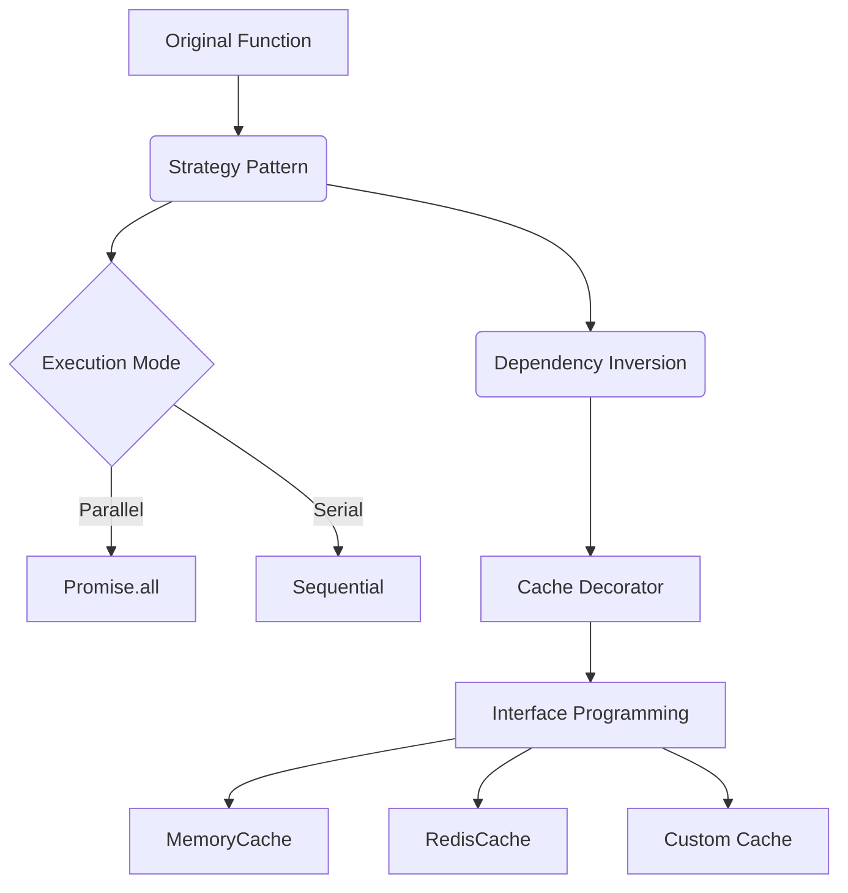

# 🌟 async-processor

[![npm version][npm-version-src]][npm-version-href]
[![npm downloads][npm-downloads-src]][npm-downloads-href]
[![bundle][bundle-src]][bundle-href]
[![JSDocs][jsdocs-src]][jsdocs-href]
[![License][license-src]][license-href]

English | [简体中文](./README.md)

---

## 🌟 Features

- ✨ **Lightweight**: Zero-dependency, core <1kb
- ⚡ **High Performance**: Smart parallel processing + cache reuse
- 🔄 **Multi-strategy**: Parallel/Serial modes
- 💾 **Extensible Cache**: Memory/LocalStorage/Custom stores
- 🔧 **Type Safe**: Full TypeScript support
- 🎯 **Error-first Conversion**: Auto convert callback to Promise

## 📦 Installation

```bash
npm install async-processor
```

## 🛠 Quick Start

### 🔄 Basic Usage
```ts
import { createAsyncProcessor } from 'async-processor'

function asyncAdd(a: number, b: number, cb: (err: any, res: number) => void) {
  setTimeout(() => cb(null, a + b), 1000)
}

const processor = createAsyncProcessor(asyncAdd)
processor(5, 3).then(console.log) // ➡️ 8
```

### 🚀 Advanced: Multi-argument Sum
```ts
const sumProcessor = createAsyncProcessor(asyncAdd, {
  mode: 'parallel',
  keyGenerator: (a, b) => `add_${a}_${b}`
})

async function sum(...nums: number[]) {
  return sumProcessor(...nums)
}

sum(1, 2, 3, 4, 5).then(console.log) // 15 (~1.2s)
```

## ⚙️ Configuration

| Option          | Type                  | Default       | Description              |
|-----------------|-----------------------|---------------|--------------------------|
| `mode`         | `parallel \| serial` | `parallel`    | Execution mode          |
| `cache`        | `CacheStore \| false`| `MemoryCache` | Cache instance or false |
| `keyGenerator` | `(...args) => string`| JSON stringify| Cache key generator     |

## 🔧 Extensibility

### 💾 Custom Cache
```ts
class RedisCache implements CacheStore {
  async get(key: string) {
    return redisClient.get(key)
  }

  async set(key: string, value: any) {
    await redisClient.set(key, value)
  }
}

const processor = createAsyncProcessor(asyncAdd, {
  cache: new RedisCache()
})
```

## 📖 API Docs

### `createAsyncProcessor(originalFunc, options?)`
```ts
interface Options<Args extends any[]> {
  mode?: 'parallel' | 'serial'
  cache?: CacheStore | false
  keyGenerator?: (...args: Args) => string
}

function createAsyncProcessor<Args extends any[], Result>(
  func: (...args: [...Args, (err: any, res: Result) => void]) => void,
  options?: Options<Args>
): (...args: Args) => Promise<Result>
```

## 🎯 Design Philosophy

### 🧩 Composable Architecture


---

## License

[MIT](./LICENSE) License © [Sunny-117](https://github.com/Sunny-117)

<!-- Badges -->

[npm-version-src]: https://img.shields.io/npm/v/async-processor?style=flat&colorA=080f12&colorB=1fa669
[npm-version-href]: https://npmjs.com/package/async-processor
[npm-downloads-src]: https://img.shields.io/npm/dm/async-processor?style=flat&colorA=080f12&colorB=1fa669
[npm-downloads-href]: https://npmjs.com/package/async-processor
[bundle-src]: https://img.shields.io/bundlephobia/minzip/async-processor?style=flat&colorA=080f12&colorB=1fa669&label=minzip
[bundle-href]: https://bundlephobia.com/result?p=async-processor
[license-src]: https://img.shields.io/github/license/Sunny-117/async-processor.svg?style=flat&colorA=080f12&colorB=1fa669
[license-href]: https://github.com/Sunny-117/async-processor/blob/main/LICENSE
[jsdocs-src]: https://img.shields.io/badge/jsdocs-reference-080f12?style=flat&colorA=080f12&colorB=1fa669
[jsdocs-href]: https://www.jsdocs.io/package/async-processor
