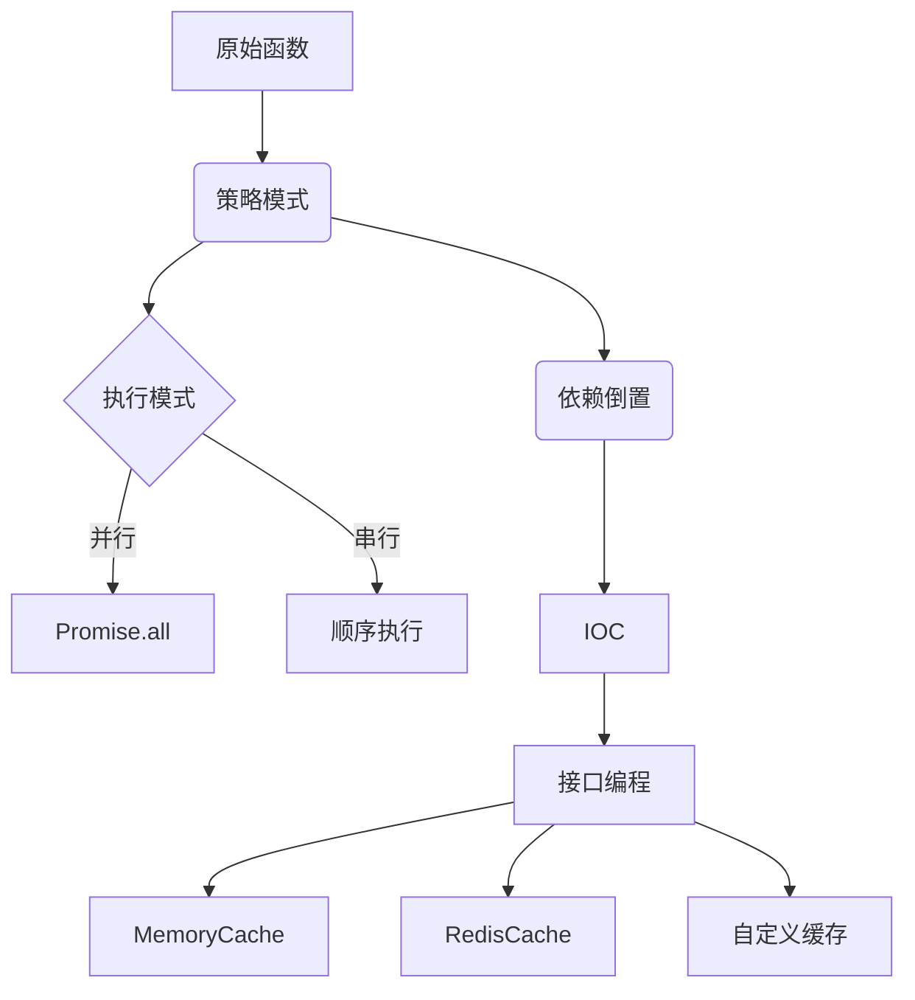

# 🌟 async-processor

简体中文 | [English](./README-en.md)

---

## 🚀 特性

- ✨ **轻量级**：零依赖，核心代码 <3kb
- ⚡ **高性能**：智能并行处理 + 缓存复用
- 🔄 **多策略**：并行/串行执行模式自由切换
- 💾 **可扩展缓存**：内存/LocalStorage/自定义存储
- 🔧 **类型安全**：完整的 TypeScript 支持
- 🎯 **错误优先转换**：自动将回调转为 Promise

## 📦 安装

```bash
npm install async-processor
```

## 🛠 快速开始

### 🔄 基础用法
```ts
import { createAsyncProcessor } from 'async-processor'

// 1️⃣ 定义原始异步函数
function asyncAdd(a: number, b: number, cb: (err: any, res: number) => void) {
  setTimeout(() => cb(null, a + b), 1000)
}

// 2️⃣ 创建处理器
const processor = createAsyncProcessor(asyncAdd)

// 3️⃣ Promise风格调用
processor(5, 3).then(console.log) // ➡️ 8
```

### 🚀 高级示例：多参数求和
```ts
// 创建优化处理器
const sumProcessor = createAsyncProcessor(asyncAdd, {
  mode: 'parallel',
  keyGenerator: (a, b) => `add_${a}_${b}`
})

// 递归求和函数
async function sum(...nums: number[]) {
  return sumProcessor(...nums)
}

// 使用示例
sum(1, 2, 3, 4, 5).then(console.log) // 15 (仅需~1.2s)
```

## ⚙️ 配置选项

| 选项            | 类型                  | 默认值         | 描述                      |
|-----------------|-----------------------|---------------|--------------------------|
| `mode`         | `parallel \| serial` | `parallel`    | 执行模式                 |
| `cache`        | `CacheStore \| false`| `MemoryCache` | 缓存实例或禁用缓存       |
| `keyGenerator` | `(...args) => string`| JSON序列化    | 自定义缓存键生成策略     |

## 🔧 扩展能力

### 💾 自定义缓存
```ts
import { CacheStore } from 'async-processor'

class RedisCache implements CacheStore {
  async get(key: string) {
    return redisClient.get(key)
  }

  async set(key: string, value: any) {
    await redisClient.set(key, value)
  }
}

const processor = createAsyncProcessor(asyncAdd, {
  cache: new RedisCache()
})
```

## 📖 API 文档

### `createAsyncProcessor(originalFunc, options?)`
```ts
interface Options<Args extends any[]> {
  mode?: 'parallel' | 'serial'
  cache?: CacheStore | false
  keyGenerator?: (...args: Args) => string
}

function createAsyncProcessor<Args extends any[], Result>(
  func: (...args: [...Args, (err: any, res: Result) => void]) => void,
  options?: Options<Args>
): (...args: Args) => Promise<Result>
```

## 🎯 设计理念

### 🧩 组合式架构

